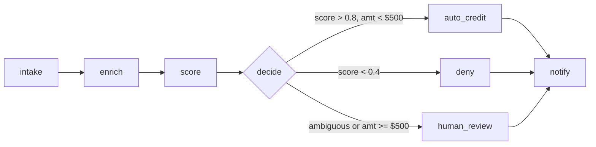
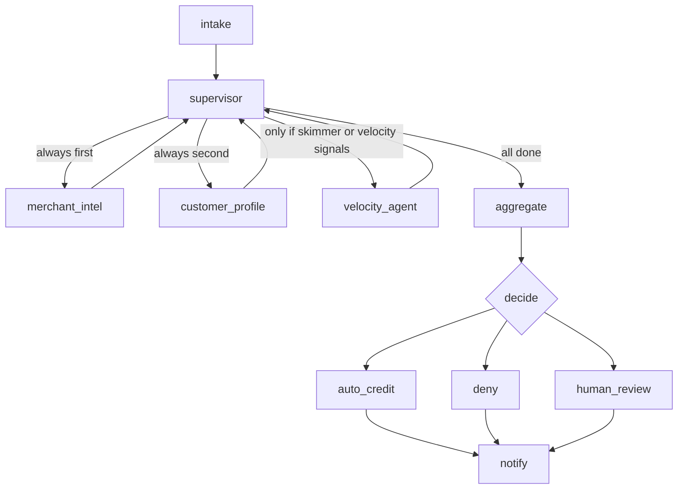
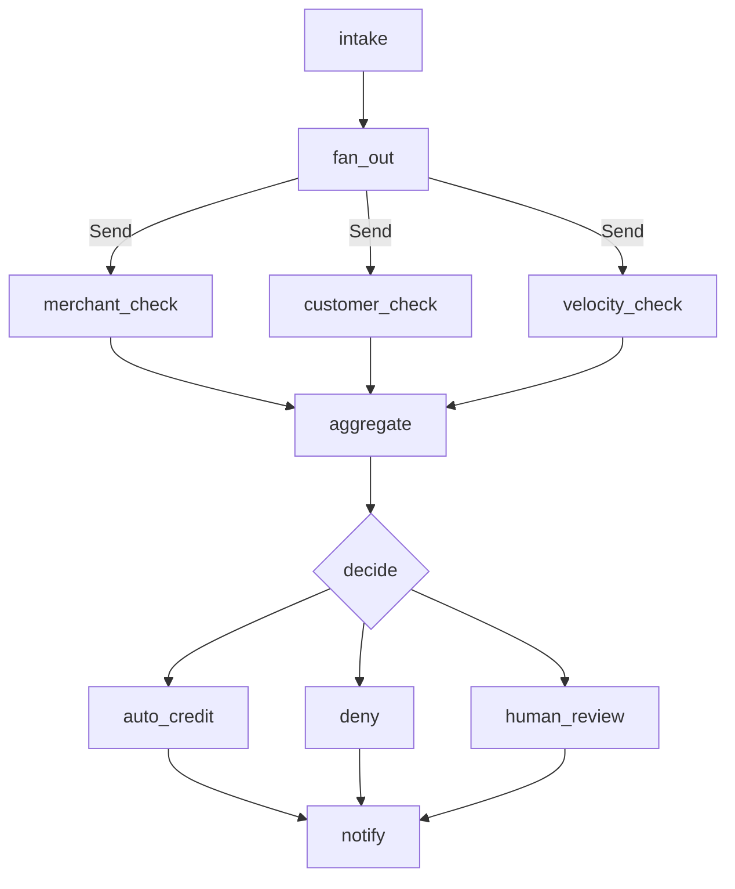
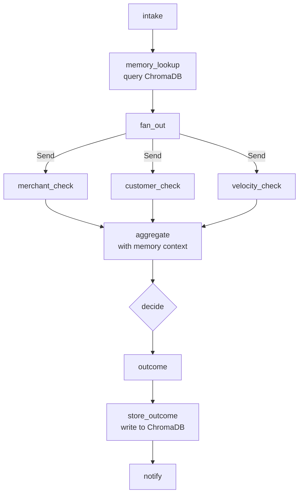
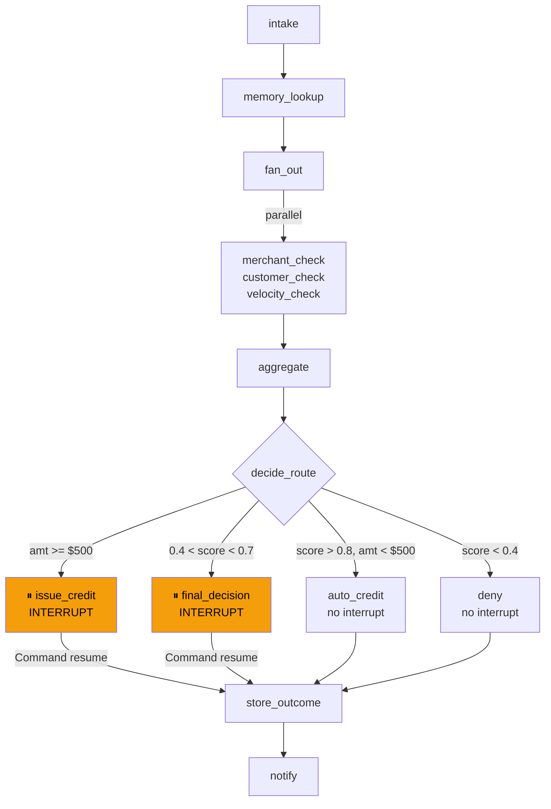

# Fraud Disputes Resolution — Multi-Agent AI System

A production-grade multi-agent system that automates credit card fraud dispute investigation and resolution using **LangGraph** + **Claude / OpenAI**. Built as a progressive learning path — each phase introduces a new agentic pattern on top of the last.

> **Demo scenario:** A large bank processes thousands of disputes per day. Most are straightforward — a merchant the customer has never visited, in a city they've never been to. Today that takes 7–10 business days. This system resolves clear-cut cases in seconds and hands ambiguous ones to a human analyst with a structured evidence brief.

---

## Tech Stack

| Layer | Choice |
|---|---|
| LLM | Claude (Anthropic) or OpenAI — switchable via env var |
| Agent orchestration | LangGraph (StateGraph, Send API, interrupt) |
| Short-term memory | SQLite via `AsyncSqliteSaver` (resumable threads) |
| Long-term memory | ChromaDB (cross-dispute pattern accumulation) |
| Observability | LangSmith (full trace per dispute) |
| Validation | Pydantic v2 |
| Runtime | Python 3.11+, `uv` |

---

## Quickstart

### 1. Clone and install

```bash
git clone https://github.com/ramprasathsampathkumar/fraud-disputes-resolution.git
cd fraud-disputes-resolution
uv sync
```

### 2. Configure environment

```bash
cp .env.example .env
```

Edit `.env`:

```bash
# Choose provider: anthropic | openai
LLM_PROVIDER=anthropic
ANTHROPIC_API_KEY=sk-ant-...

# Or OpenAI
# LLM_PROVIDER=openai
# OPENAI_API_KEY=sk-...

# LangSmith (optional but recommended — free tier at smith.langchain.com)
LANGCHAIN_TRACING_V2=true
LANGCHAIN_API_KEY=lsv2_pt_...
LANGCHAIN_PROJECT=fraud-disputes-resolution
```

### 3. Run any phase

```bash
# Phase 1.2 — State machine (single dispute)
uv run python -m phase1_2_state_machine.graph --dispute DISP-001

# Phase 2.1 — Supervisor pattern (all 4 disputes)
uv run python -m phase2_1_supervisor.graph

# Phase 2.2 — Parallel fan-out with timing
uv run python -m phase2_2_parallel.graph --dispute DISP-004

# Phase 3.1 — Long-term memory demo
uv run python -m phase3_1_persistence.graph --dispute DISP-001          # cold run
uv run python -m phase3_1_persistence.graph --seed-memory               # seed ChromaDB
uv run python -m phase3_1_persistence.graph --dispute DISP-001 --warm   # warm run

# Phase 3.2 — Human-in-the-loop (interactive)
uv run python -m phase3_2_human_in_loop.graph --dispute DISP-002
uv run python -m phase3_2_human_in_loop.graph --dispute DISP-002 --auto-approve  # non-interactive
```

### 4. LangGraph Studio (visual debugger)

```bash
uv run langgraph dev --port 8123
```

Open the Studio URL printed in the terminal. All phases appear as graph tabs — submit a dispute and watch nodes execute step by step.

---

## Demo Disputes

Four disputes, each designed to exercise a different code path:

| ID | Amount | Merchant | Expected outcome |
|---|---|---|---|
| `DISP-001` | $340 | Biscayne Grill, Miami FL | Auto-credit — 47 prior fraud disputes, customer never in FL |
| `DISP-002` | $1,200 | Apple Store Online | Human review — regular Apple buyer but amount 3.5× avg, unknown device |
| `DISP-003` | $18.50 | Netflix | Deny — active subscriber, recurring charge, recognised device |
| `DISP-004` | $340 × 5 | Shell Gas Station | Auto-credit — velocity attack, card skimmer, 5 charges in 78 min |

---

## Implementation Phases

### Phase 1.2 — LangGraph State Machine

**Pattern:** Typed state + named nodes + deterministic conditional edges.

Every dispute flows through an explicit pipeline. No free-form agent loops — each node has a single responsibility and the graph always knows exactly where execution is.



**Key concepts:**
- `DisputeState` TypedDict — single source of truth flowing through every node
- `Annotated[list, operator.add]` reducer — safe parallel appends to `evidence`
- `AsyncSqliteSaver` — every node transition checkpointed to disk
- Deterministic routing — conditional edges use code, not LLM decisions

---

### Phase 2.1 — Supervisor Multi-Agent Pattern

**Pattern:** One orchestrator LLM routes to specialist agents in a loop.



**Key concepts:**
- Supervisor uses cheap classifier model for routing — investigator model reserved for scoring
- Each specialist agent is deliberately isolated — merchant agent cannot see customer data
- `agents_called` list prevents the supervisor from re-running the same agent
- `DISP-004` uniquely triggers `velocity_agent` — others follow the two-agent path

---

### Phase 2.2 — Parallel Fan-out (Send API)

**Pattern:** Deterministic fan-out dispatches all checks simultaneously using LangGraph's `Send` API.



**Phase 2.1 vs 2.2:**

| | Phase 2.1 Supervisor | Phase 2.2 Parallel |
|---|---|---|
| Routing | LLM decides next agent | Deterministic `fan_out` function |
| Execution | Sequential (one at a time) | Parallel (all at once) |
| LLM calls | 3–4 routing + 1 aggregate | 1 aggregate only |
| Wall time | ~4.5s (simulated) | ~2.0s (simulated) |

**Key concepts:**
- `fan_out` returns `list[Send]` — LangGraph executes all branches concurrently
- `Annotated[list, operator.add]` reducer merges parallel findings without race conditions
- LangGraph buffers all branch results before calling `aggregate`

---

### Phase 3.1 — Persistence & Long-term Memory

**Pattern:** Short-term resumability via SQLite + long-term cross-dispute learning via ChromaDB.



**The memory demo — DISP-001:**

| Run | Memory | Score | Decision |
|---|---|---|---|
| Cold | None | ~0.91 | Auto-credit |
| Warm | "CUST-4821 travels to Miami every April" | ~0.55 | Human review |

Same transaction. Same signals. Different outcome because memory told the LLM the Miami trip is a known pattern.

**Key concepts:**
- `memory_lookup` queries ChromaDB before parallel checks — context enriches scoring
- `store_outcome` embeds each resolution into ChromaDB — system learns over time
- `model_reasoning` carries the LLM's scoring explanation (separate from `human_notes`)
- Thread-based resumability: re-running with the same `thread_id` picks up from last checkpoint

---

### Phase 3.2 — Human-in-the-Loop

**Pattern:** `interrupt()` pauses graph mid-execution at two trigger points. `Command(resume=)` continues from exactly where it paused.



**Two interrupt triggers:**

| Interrupt node | Trigger | Why |
|---|---|---|
| `issue_credit` | Amount ≥ $500 | Irreversible high-value action — always needs human sign-off |
| `final_decision` | 0.4 < score < 0.7 | Conflicting signals — model isn't confident enough |

**What the analyst receives at interrupt:**
```
⏸ ANALYST REVIEW REQUIRED
DISPUTE: DISP-002 | Amount: $1,200.00 | Merchant: Apple Store Online
Customer: CUST-1143

EVIDENCE:
  ✓ [merchant_check] clean — 3 disputes, 0.8% fraud rate
  ⚠ [customer_check] unrecognised device DEV-UNKNOWN-3341
  ⚠ [customer_check] amount $1200 is 2.7× avg ($445)
  ✓ [customer_check] recurring: 4 prior charge(s) at same merchant

Model reasoning: Customer is a regular Apple buyer but this charge is unusually
large and originated from an unknown device...

Fraud Score: 0.61 (AMBIGUOUS)
ACTION REQUIRED: approve_credit | deny | request_more_info
```

**Key concepts:**
- `interrupt()` serialises full graph state to SQLite — analyst can resume hours later
- `model_reasoning` shows LLM's thinking; `human_notes` captures the analyst's decision
- Resume payload injected via `Command(resume={"decision": "approve_credit", "analyst_notes": "..."})`
- Non-interrupt paths (`auto_credit`, `deny`) are fully automated — no human needed

---

## State Schema

All phases share a common state structure that grows progressively:

```python
class DisputeState(TypedDict):
    # Core identity
    dispute_id: str
    customer_id: str
    transaction: dict           # amount, merchant, location, device_id

    # Populated by specialist agents
    merchant_profile: dict
    customer_profile: dict

    # Accumulated across all nodes — operator.add reducer makes parallel writes safe
    evidence: Annotated[list[str], operator.add]

    # Scoring
    fraud_score: float          # 0.0 → 1.0
    model_reasoning: str        # LLM's explanation of its score (every phase)

    # Decision lifecycle
    decision: Literal["auto_credit", "deny", "human_review", "pending"]
    resolution_amount: float

    # Human-in-the-loop (Phase 3.2 only)
    human_notes: str            # analyst notes entered at interrupt
    analyst_approved: bool | None

    # Completion
    notification_sent: bool
    error: str | None
```

---

## Fraud Scoring Signals

| Signal | Score delta |
|---|---|
| Known card skimmer at merchant | +0.4 |
| Merchant > 20 prior disputes | +0.3 |
| Merchant fraud rate > 15% | +0.2 |
| Unrecognised device | +0.2 |
| Location anomaly vs home city | +0.2 |
| Amount > 3× customer average | +0.2 |
| Velocity attack (3+ charges, 2h window) | +0.5 |
| Recurring charge at same merchant | −0.4 |
| Clean merchant | −0.2 |

| Score | Decision |
|---|---|
| > 0.8 AND amount < $500 | Auto-credit |
| 0.4 – 0.8 OR amount ≥ $500 | Human review / interrupt |
| < 0.4 | Deny |

---

## Project Structure

```
fraud-disputes-resolution/
├── shared/
│   ├── models.py                    ← Pydantic models + DisputeState schema
│   ├── mock_data.py                 ← 4 dispute fixtures (transactions, merchants, customers)
│   ├── tools.py                     ← LangChain @tool definitions
│   └── model_factory.py             ← Provider-agnostic LLM instantiation
│
├── phase1_2_state_machine/graph.py  ← Typed StateGraph, conditional edges, checkpointing
├── phase2_1_supervisor/graph.py     ← Supervisor + specialist agents loop
├── phase2_2_parallel/graph.py       ← Send API fan-out, parallel execution
├── phase3_1_persistence/graph.py    ← ChromaDB memory lookup + store outcome
├── phase3_2_human_in_loop/graph.py  ← interrupt() + Command(resume=) pattern
│
├── langgraph.json                   ← LangGraph Studio graph registry
├── pyproject.toml                   ← Dependencies (uv)
└── .env.example                     ← Environment variable template
```

---

## Observability

Every run is automatically traced in LangSmith. Each trace shows:
- Full node execution tree with timing
- LLM inputs and outputs at `aggregate` / `score` nodes
- State diff at every node transition — including `model_reasoning` and `fraud_score`
- Token usage and cost per dispute

To view: [smith.langchain.com](https://smith.langchain.com) → project `fraud-disputes-resolution` → Traces.

---

## Roadmap

- [ ] Phase 3.3 — Streaming dashboard (`astream_events`)
- [ ] Phase 3.4 — Error handling & retries (exponential backoff, fallback edges)
- [ ] Phase 4 — Testing (unit, integration, LangSmith eval datasets)
- [ ] Phase 5 — Deployment (FastAPI, Docker, LangGraph Platform)
- [ ] Phase 6 — Airflow orchestration (batch processing DAGs, SLA monitoring)
